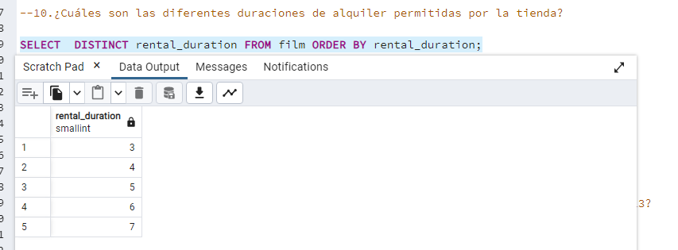

#Ejercicio 5: Consultas SQL, base de datos DVD rental

-1.Selecciona las columnas film_id y title de la tabla film.
```SELECT film_id, title FROM film;```


-2.Selecciona 5 filas de la tabla film, obteniendo todas las columnas.

```SELECT * FROM film limit 5;```


-3.Selecciona filas de la tabla film donde film_id sea menor que 4.

```SELECT * FROM film WHERE film_id<4;```


-4.Selecciona filas de la tabla film donde el rating sea PG o G.

```SELECT * FROM film WHERE rating='PG' OR rating='G';```


-5.Selecciona filas de la tabla actor donde el nombre sea Angela, Angelina o Audrey usando IN.
```SELECT * FROM actor WHERE first_name IN( 'Angela', 'Angelina', 'Audrey');```


-6.Obtén una lista de actores con el nombre Julia.

```SELECT * FROM actor WHERE lower(first_name) ='julia';```


-7.Obtén una lista de actores con los nombres Chris, Cameron o Cuba.


```SELECT * FROM actor WHERE first_name IN ('Chris', 'Cameron','Cuba');```


-8.Selecciona la fila de la tabla customer para el cliente con el nombre Jamie Rice.

```SELECT * FROM customer WHERE first_name='Jamie' AND last_name='Rice';```


-9.Selecciona el monto y la fecha de pago de la tabla payment donde el monto pagado sea menor a $1.

```SELECT amount,payment_date FROM payment WHERE amount<1;```

-10.¿Cuáles son las diferentes duraciones de alquiler permitidas por la tienda?

```SELECT  DISTINCT rental_duration FROM film ORDER BY rental_duration;```

-11.Ordena las filas en la tabla city por country_id y luego por city.

```SELECT * FROM city ORDER BY country_id DESC,city DESC ;```


-12.¿Cuáles son los ID de los últimos 3 clientes que devolvieron un alquiler?

```SELECT * FROM rental WHERE return_date IS NOT NULL ORDER BY return_date DESC LIMIT 3;```

-13.¿Cuántas películas tienen clasificación NC-17? ¿Cuántas tienen clasificación PG o PG-13?

```SELECT rating, COUNT(rating) FROM film WHERE rating IN('PG', 'PG-13','NC-17')GROUP BY rating;```

-14.¿Cuántos clientes diferentes tienen registros en la tabla rental?

```SELECT COUNT(DISTINCT customer_id) FROM rental;```

-15.¿Hay algún cliente con el mismo apellido?

```SELECT last_name , COUNT(*) AS cantidad FROM customer GROUP BY last_name HAVING COUNT(*) > 1;```


-16.¿Qué película (id) tiene la mayor cantidad de actores?

```SELECT film_id, COUNT(actor_id) as actor_count FROM film_actor GROUP BY film_id ORDER BY actor_count DESC LIMIT 1;```


-17.¿Qué actor (id) aparece en la mayor cantidad de películas?

```SELECT actor_id, COUNT(actor_id)as actor_count FROM film_actor GROUP BY actor_id ORDER BY actor_count DESC LIMIT 1 ;```

-18.Cuenta el número de ciudades para cada country_id en la tabla city. Ordena los resultados por count(*).

```SELECT country_id, COUNT(country_id)AS country_count FROM city GROUP BY country_id ORDER BY country_count ;```


-19.¿Cuál es la tarifa de alquiler promedio de las películas? ¿Puedes redondear el resultado a 2 decimales?

```SELECT ROUND(AVG(rental_rate),2) AS rental_rate_avg FROM film;;```


-20.Selecciona los 10 actores que tienen los nombres más largos (nombre y apellido combinados).

```SELECT first_name, last_name, LENGTH(first_name || last_name) as full_name_size FROM actor ORDER BY full_name_size DESC LIMIT 10;```
